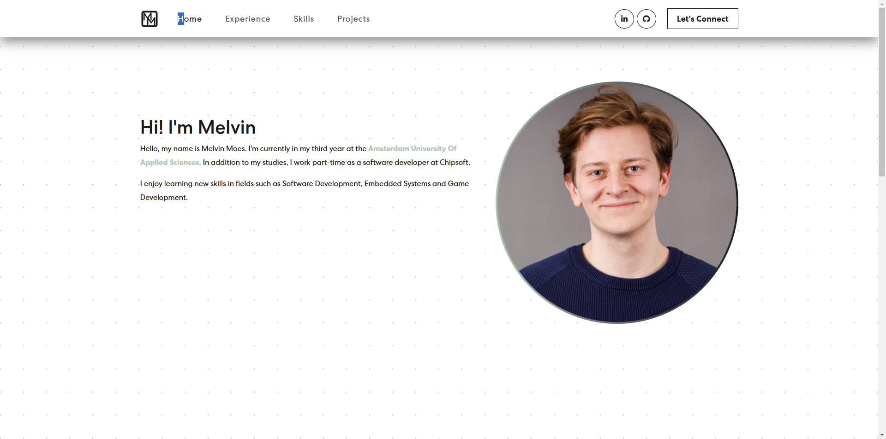

# Portfolio Website

This project is a portfolio website for showcasing personal projects, skills, and experiences. 
It is intended to provide a professional look into my previous work and serve as my digital resume.

The website is built using React, a popular JavaScript library for building user interfaces. 
To streamline the development process, Vite is used as the build tool and development server allowing for easy testing making the development experience smooth and productive.

